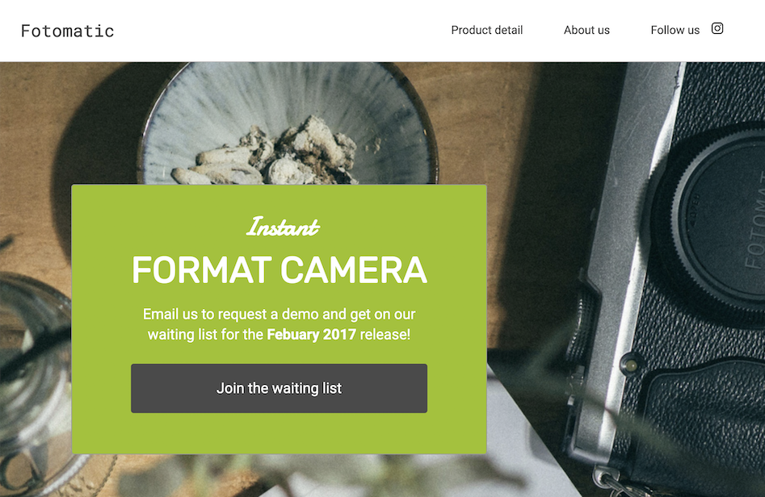

# Fotomatic

**_View this project_**: [https://genuine-gumdrop-9a714a.netlify.app/](https://genuine-gumdrop-9a714a.netlify.app/)

## Description

Student project for Codecademy Full Stack Path.

**_Learning objective_**: To fix the layout and responsiveness of the broken website and reproduce the layout from the design spec provided. Since the HTML was already provided, this project specifically showcases skill in CSS and debugging.

## Features

- Extensive debugging of unfamiliar code, written by another developer and riddled with problems. This process required a high-level understanding of how to read the given code and relate it to the broken page in order to fix its many issues.

- Responsive CSS, including responsive navigation, responsive images, and advanced techniques such as flexbox, CSS variables, relative units, and media queries, with content visibility selectively hidden based on the design spec

- Follows design spec for desktop and mobile display and includes client's media assets (images and icons), thereby simulating a professional collaboration with a UX/UI designer

- Boosted the accessibility report by a Lighthouse audit of the repaired web site from a dismal 56/100 for desktops and 56/100 for mobile devices to a much-improved 95/100 for desktops and 95/100 for mobile devices, without reconfiguring the given HTML or affecting the color prescribed by the design spec.

- Skilled use of Google Chrome's DevTools for debugging and prototyping changes in the browser

- Coded in VS Code using professional development workflow tools such as Live Server and GitHub Desktop, with hosting on Netlify using continuous deployment

- A polished README using Markdown

## Design Spec

## Preview - Before and After

- First image below is of the broken website, as I received it
- Second image below is of the repaired website, after my interventions

